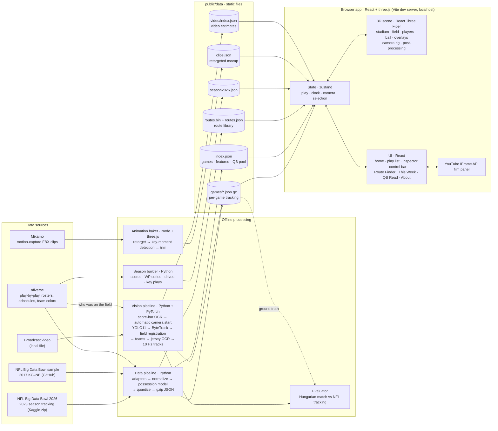

# Sideline

3D replays of real NFL plays from player-tracking data, plus a computer-vision pipeline that recovers player positions from broadcast video and is scored against the NFL's own tracking.

| Page | What it does |
|---|---|
| **Home** | The front door: a featured play running live in 3D behind the pitch, the four tools with diagrams drawn from real tracking, featured plays, the broadcast-video results and where the data comes from. |
| **Replay** | Every tracked player on every frame (10 Hz) in a 3D stadium. Broadcast, All-22, end-zone, QB and follow cameras; scrub the play, click a player to follow them, watch film alongside. |
| **QB Read** | The play freezes just before the throw. Pick a receiver, then see who the QB actually threw to and how much separation each option had. |
| **Route Finder** | Sketch a route; 65,000+ real routes are ranked by how closely they start the same way. Matches open in Replay. |
| **This Week** | Current-season scores, win-probability charts, drive charts and the plays that swung each game. |
| **About** | The data sources, how a play is rebuilt, what's measured versus modelled, and the video pipeline's measured accuracy. |

Every page has its own link (`#/replay`, `#/qb-read`, `#/route-finder`, `#/this-week`, `#/about`), Replay links include the play (`#/replay/2023123000-698`), and the browser's back and forward buttons move between them.

**Contents:** [Architecture](#architecture) · [Tech stack](#tech-stack) · [Data](#data) · [How AI is used](#how-ai-is-used) · [How it works](#how-it-works-end-to-end) · [Run it](#run-it) · [Project layout](#project-layout) · [Testing](#testing) · [Limits](#known-limits) · [Rights](#rights)

---

## Architecture



There is no backend server. Python and Node scripts do the heavy work offline and write static files; the Vite dev server serves them on localhost, and everything else happens in the browser on the GPU.

---

## Tech stack

### Browser app

| Layer | Technology | Version | Role |
|---|---|---|---|
| Language | TypeScript | 5.6 | Strict mode, whole front end |
| UI framework | React | 18.3 | Components, modes, panels |
| Build / dev server | Vite (+ @vitejs/plugin-react) | 5.4 | Localhost server with hot reload, production bundling |
| 3D engine | three.js | 0.169 | WebGL rendering, skinned meshes, animation mixer |
| React renderer for 3D | React Three Fiber | 8.17 | Declarative scene graph, render loop |
| 3D helpers | drei | 9.117 | Orbit controls, GLTF loading, environment lighting, billboards, lines, HTML labels |
| Post-processing | @react-three/postprocessing / postprocessing | 2.16 / 6.36 | N8AO ambient occlusion, bloom, vignette, ACES tone mapping, SMAA |
| Animation math | maath | 0.10 | Critically damped camera easing |
| State | zustand | 5.0 | Play clock, camera, selection, mode; read inside the render loop without re-rendering React |
| Type | Barlow Condensed, Inter (Fontsource) | 5.3 | Self-hosted fonts (works offline) |
| Film | YouTube IFrame Player API | — | Embedded clips, snap sync between film and 3D |
| Browser APIs | DecompressionStream, Canvas 2D, ResizeObserver, localStorage | — | Gzip decoding, procedural textures, film links and QB Read score |

### Data pipeline

| Technology | Version | Role |
|---|---|---|
| Python | 3.10 | Pipeline language |
| pandas | 2.2 | CSV ingest, joins, grouping per game and play |
| NumPy | 1.26 | Coordinate normalization, resampling, quantization |
| zipfile / gzip / json (stdlib) | — | Read Kaggle zips in place; write compressed per-game files |
| nflverse data releases (GitHub) | — | Play-by-play, schedules, weekly rosters, team colors |

### Animation

| Technology | Role |
|---|---|
| Mixamo (Adobe) | Motion-capture clips: QB pass, snap, stance, catches, sprint, backpedal, celebration |
| three.js FBXLoader + GLTFLoader in Node | Load clips and the player model outside the browser |
| Custom retargeter (`scripts/bake-anims.mjs`) | World-space rotation transfer from the FBX skeleton to the GLB skeleton |
| X Bot (Mixamo, via three.js examples) | Rigged player model, dressed with a uniform shader, helmet, pads and numbers |

### Computer vision

| Technology | Version | Role |
|---|---|---|
| PyTorch (Apple MPS backend) | 2.14 | Runs the detector on the Mac GPU |
| Ultralytics YOLO11m | 8.4 | Person detection |
| ByteTrack (+ lap) | via Ultralytics | Multi-object tracking with stable IDs |
| OpenCV | 4.11 | Paint mask (HSV + morphological top-hat), distance transform, ORB features, RANSAC homography, phase correlation |
| SciPy | 1.15 | Powell optimizer for homography fitting, KD-tree for ICP, Savitzky–Golay smoothing, Hungarian assignment |
| scikit-learn | 1.7 | k-means jersey-colour clustering |
| EasyOCR | 1.7 | Score-bar clock and jersey-number reading (on the Mac GPU) |
| FFmpeg | 8.0 | Frame extraction, contact sheets, debug video |

### Testing and tooling

| Technology | Role |
|---|---|
| Vitest 2.1 | Unit tests (play math, route matching) and a three.js rig regression test running the real model and mixer in Node |
| Python fixture tests | Synthetic datasets in each Big Data Bowl format, run through the full pipeline |
| TypeScript compiler | `tsc --noEmit` type checking |

---

## Data

| Source | Coverage | Notes |
|---|---|---|
| NFL Big Data Bowl 2026 ([Kaggle](https://www.kaggle.com/competitions/nfl-big-data-bowl-2026-analytics/data), CC BY-NC 4.0) | 2023 season, weeks 1–18, 14,000+ pass plays | QB, route runners and coverage defenders only; tracking ends when the ball arrives |
| NFL Football Operations [Big Data Bowl sample](https://github.com/nfl-football-ops/Big-Data-Bowl) | 2017 Week 1, KC at NE, every snap | All 22 players and the ball |
| [nflverse](https://github.com/nflverse/nflverse-data) | 1999–present, nightly in season | Play-by-play with EPA and win probability, schedules, rosters, team colours; play participation (the 22 on the field, 2016 on) for naming players in video |
| Broadcast video (local) | Any clip you have | Input to the vision pipeline; measured on a condensed KC–NE 2017 broadcast |

Tracking is NFL Next Gen Stats: RFID chips in the shoulder pads, sampled 10 times a second. Anything a release doesn't contain is modelled and labelled in the app (e.g. players untracked after the throw are drawn faded).

**Built output (current):** 14,242 plays from 273 games, 65,134 routes, 14,051 QB Read plays, ~33 MB compressed.

---

## How AI is used

AI shows up in two places: a computer-vision pipeline built here, and pretrained statistical models the app consumes. A lot of the project is deliberately *not* machine learning; that is listed too.

### 1. Computer vision: broadcast video → field positions (`vision/`)

Turns broadcast footage into player coordinates in yards, the same format as NFL tracking, so a play can be replayed in 3D even when no tracking is public.

| Step | Technique | Type |
|---|---|---|
| Find the play in the video | **EasyOCR** (CRAFT text detector + CRNN recognizer) reads the score bar's quarter and game clock every 0.5 s; a play's snap is where the clock ticks below its snap time | Deep learning (OCR) |
| Start the camera automatically | One calibrated wide shot per broadcast is swept over pan, zoom and tilt against the paint, polished, and snapped to the 5-yard alignment that puts the players on the line of scrimmage; close-ups and dissolves are rejected because players come out the wrong size | Classical CV + optimization |
| Find players | **YOLO11** convolutional object detector (pretrained on COCO "person"), 1280 px input, Apple GPU | Deep learning |
| Keep identities | **ByteTrack**: Kalman-filter motion model + detection association | ML tracking |
| Locate the camera | A to-scale template of the paint (yard lines, sidelines, hash marks, ticks) is fitted to a paint mask by optimizing an 8-parameter homography against a distance transform; paint hidden behind players or the score bar is left out of the score; ICP recovers from large errors | Classical CV + optimization |
| Follow fast pans | ORB features + RANSAC homography chained over every frame carry the camera through motion blur; fits that disagree with the motion are rejected, and 5-yard yard-line aliasing is corrected | Classical CV |
| Split teams | **k-means** on torso colour (Lab colour space); each colour is tied to offense or defense by which side of the line it starts on | Unsupervised ML |
| Name players | **EasyOCR** on torso crops (three contrast variants), votes across frames, limited to the 22 numbers on the field for that play (nflverse participation) and the track's team; officials skipped | Deep learning (OCR) + rules |
| Measure accuracy | Every play of a game found, fitted and tracked without hand setup, then Hungarian matching against NFL tracking for the same play | Evaluation |

**Measured accuracy** (KC at NE 2017, condensed NBC broadcast vs NFL tracking of the same plays; details in [vision/README.md](vision/README.md)):

| | Result |
|---|---|
| Whole game, automatic: plays found in the video and started without hand setup | 50 of 68 |
| Position error over those 50 plays | median **1.51 yd** · mean 1.84 · 90th pct 3.91; 71% of positions matched to a tracked player |
| One play (Smith → Hill, 75-yd TD), hand-made first-frame fit | median **0.63 yd** · 90th pct 1.82; 95% matched |
| Jersey names | ~4 players named per play; 91% right when checked by eye (32 of 35 readable names) |

Two fixes found while measuring did most of the work on the single play (1.84 → 0.63 yd median): keeping hash marks in the paint mask (perspective squashes them into dots that a blob filter threw away), and not counting paint hidden behind the score bar or players as misses (the fit was squashing the field to avoid them). Part of the remaining gap is what each system measures: tracking chips sit in the shoulder pads, the video uses the feet.

### 2. Pretrained models used, not trained here

- **Expected points (EPA) and win probability** from nflverse's nflfastR models (gradient-boosted trees trained on decades of play-by-play).
- **YOLO11** weights from Ultralytics (COCO pretraining).
- **EasyOCR** English text models (score bar and jersey digits).

### Not machine learning (on purpose)

| Feature | How it works |
|---|---|
| Route Finder | Shape search: routes resampled by arc length and compared point-to-point (nearest neighbours) |
| Ball possession | Rules: who has the ball is rebuilt from play events (snap, handoff, throw, catch) and the play description, because raw ball tracking isn't reliable |
| Player animation | Motion-captured clips retargeted to the skeleton and timed to real events, plus procedural poses |
| QB Read "most open" | Distance to the nearest defender, and the app says so |

---

## How it works, end to end

### 1. Ingest and normalize (`pipeline/`)

1. **Adapters** (`adapters.py`, `adapters_2026.py`) convert each Big Data Bowl release into one layout. They derive what a release lacks: play direction and body orientation (2017), the line of scrimmage, a ball path and jersey numbers matched from nflverse rosters (2026).
2. **Normalize**: every play is flipped so the offense moves toward +x; orientations rotate with it.
3. **Possession model** (`possession.py`) decides who holds the ball on each frame: QB after the snap exchange, the rusher from the handoff, nobody while a pass is in the air, the receiver or interceptor after the catch.
4. **Quantize and package**: positions in 0.1 yd and speeds in 0.1 yd/s as integers, one gzip JSON per game. Routes (4 s after the snap, 5 Hz) go into an int16 binary library.
5. **Join context**: EPA, win probability and scores from nflverse or the release's own play table.

### 2. Bake animations (`scripts/bake-anims.mjs`)

Mixamo FBX clips are loaded in Node, retargeted to the player skeleton in world space, stripped of root drift, and analysed on the skeleton to find each clip's key moment (fastest hand speed for the release and snap, furthest reach for a catch, lowest hips for a stance). Output: `clips.json`.

### 3. Render a play (browser)

Every animation frame:

1. **Clock**: playback advances the play time; QB Read freezes it before the throw.
2. **Players**: each athlete samples position, facing and speed from the tracks (interpolated between 10 Hz frames). Locomotion blends idle → walk → run → sprint, or backpedal, with stride rate matched to real speed. The clean animation pose is saved, then event poses are layered on: stance before the snap, the hike, the QB's throw lined up with the real release frame, catches at the arrival frame, the ball tuck, a forward lean at speed. The saved pose is restored each frame so layers never accumulate.
3. **Ball**: placed in the carrier's hand from the possession model; between throw and arrival it flies on a projectile arc.
4. **Overlays**: line of scrimmage, first-down line, route trails, pass arc, selection rings.
5. **Camera rig**: preset shots follow the ball or a player, user orbit is preserved, and the camera is kept inside the stadium bowl. The home page uses a slow cinematic sweep, framed right of centre so the headline has room, and stops rendering once it's scrolled out of view.
6. **Post-processing**: ambient occlusion, bloom on the stadium lights, ACES tone mapping, anti-aliasing.

### 4. Video → 3D (`vision/`)

1. **Find the play.** `scoreboard.py` reads the broadcast clock through the whole video once; `batch.py` looks up each play's quarter and snap clock in it.
2. **Start the camera.** `autoinit.py` fits the field to a wide frame near the snap, starting from one calibrated shot of the same broadcast camera.
3. **Track.** `pipeline.py` detects and tracks players, keeps the field fitted through pans (stopping at the first camera cut), splits teams by jersey colour, and writes 10 Hz tracks in yards.
4. **Name.** `jersey.py` reads numbers where players are big in frame and keeps only numbers of the 22 on the field for that play.
5. **Export.** `export.py` joins track pieces of the same player and writes a play the app lists as "Estimated from broadcast video"; players fade while off camera.
6. **Score.** `evaluate.py` / `batch.py` compare against NFL tracking of the same play when it exists (see [How AI is used](#1-computer-vision-broadcast-video--field-positions-vision)).

---

## Run it

Requirements: Node 18+, Python 3.10+ (`pip install -r pipeline/requirements.txt`). Vision additionally needs `vision/requirements.txt` and FFmpeg.

```bash
npm install
npm run data        # tracking: 2017 sample downloads automatically; 2026 zip read from ~/Downloads
npm run season      # current-season scores from nflverse
node scripts/bake-anims.mjs   # animation clips (Mixamo FBX in public/models/anims/)
npm run dev         # http://localhost:5173
```

`npm run data -- --weeks 1 2` builds a subset; `npm run data -- --source path` builds one release (format auto-detected).

Vision:

```bash
cd vision && python3 -m venv .venv && .venv/bin/pip install -r requirements.txt
# a whole game: read the score bar, then find, fit, track, name and score every play
.venv/bin/python -m sideline_vision.scoreboard videos/game.mp4 --out out/scoreboard.csv
.venv/bin/python -m sideline_vision.batch videos/game.mp4 --scoreboard out/scoreboard.csv --game 2017090700 --ref out/kcne_ref.json --out out/batch --limit 200
# one play into the app, named from the 22 on the field
.venv/bin/python -m sideline_vision.export out/batch/2756/tracks.json --offense B --direction right --home NE --away KC --offense-team KC --title "..." --nfl-play 2017090700 2756
```

---

## Project layout

```
pipeline/
  build.py            orchestrates sources → games, index, route library
  adapters.py         2017 sample adapter, source discovery
  adapters_2026.py    Big Data Bowl 2026 adapter
  possession.py       ball possession per frame
  season.py           current-season dataset
  tests/              synthetic fixtures for each release format
scripts/
  bake-anims.mjs      Mixamo → retargeted clips.json
src/
  scene/              Stage, Field (NFL spec), Stadium, Players, rig (poses + mocap), Ball, Overlays, CameraRig
  modes/              Home, Replay (Theater), QB Read, Route Finder (DrawFind), This Week, About
  ui/                 play list, inspector, control bar, score bug, film panel, play diagrams, site footer
  lib/                data loading, play math, route matching, state, teams, URL routing
vision/
  sideline_vision/    field.py (registration), autoinit.py (automatic camera start), pipeline.py,
                      scoreboard.py (score-bar OCR), jersey.py (numbers → names), batch.py (whole game),
                      evaluate.py, export.py, audit.py
  tests/              no-footage checks: clock parsing, snap finding, naming, auto-start on a drawn field
public/
  models/             player model, animation clips
  data/               built data (generated)
```

---

## Testing

```bash
npm test            # Vitest unit + rig tests, then pipeline fixture tests
npm run test:vision # video tools, no footage or models needed
npm run typecheck
```

- Play math and route matching unit tests.
- A rig regression test runs the real player model and animation mixer for 300 paused frames to prove poses never accumulate.
- Pipeline tests push synthetic datasets in each release format end to end and check direction normalization, events, line of scrimmage, possession and route extraction.
- Vision tests parse real score-bar misreads, find snaps, check jersey naming rules (on-field numbers only, officials skipped, both teams' shared numbers), and start the camera on a drawn field from a reference aimed 4 yards off.
- Vision accuracy is measured, not unit-tested: `batch.py` scores every play of the KC–NE game against NFL tracking (see [How AI is used](#1-computer-vision-broadcast-video--field-positions-vision)).

---

## Known limits

- The 2023 release has no linemen and ends at the catch; the 2017 game is the only full-play source.
- Player models are a dressed mannequin, not likenesses; a licensed rigged model can be dropped in.
- Vision needs one calibrated wide shot per broadcast; plays start automatically from it, but 18 of 68 plays in the test video had no usable wide shot near the snap. Each play is followed until the first camera cut, players who leave the frame are held and faded, most players stay unnamed (numbers are only readable when a player is big in frame), and the ball isn't tracked.

## Keys

`Space` play/pause · `←/→` step a frame (`Shift` for 1 s) · `R` replay · `1–6` cameras · `H` full-width view · QB Read: `1–5` pick, `N` next play

## Rights

Big Data Bowl data is used under its licence (2026 release: CC BY-NC 4.0, non-commercial). Team names and colours identify teams; no NFL or club logos are used. Video is either openly licensed (CC BY 3.0 test clip) or kept local and personal. The player model and baked animation clips come from Mixamo (Adobe) and are used under Mixamo's terms; the source FBX files aren't included in the repository (download them from Mixamo to re-bake). Sideline isn't affiliated with or endorsed by the NFL.
